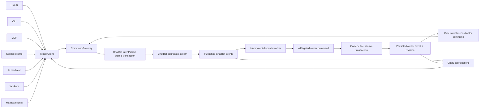
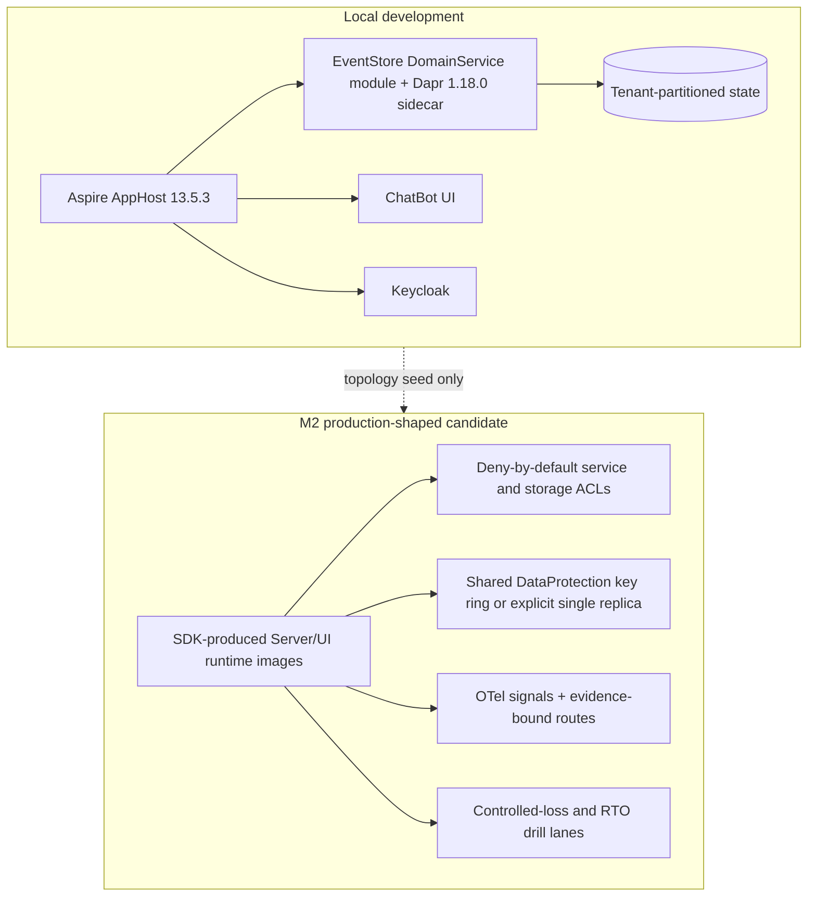

# Architecture Spine — Hexalith.ChatBot

## Design Paradigm

Hexalith.ChatBot is an event-sourced modular monolith. Hexagonal adapters translate every origin to typed
application commands/queries; one governed command spine admits mutations; owner bounded contexts remain sovereign;
event-fed projections provide tenant-scoped views. Domain rules remain pure and infrastructure depends inward.



## Source & Acceptance Baseline

- The approved PRD and addendum own normative product and executable-contract requirements. The source manifest owns
  exact repository-relative inputs, hashes, and the nine-context baseline at workspace revision
  `76f355a038c4abdb3b9fdb3fb836c25053a18fb0`; its current status is `material-gaps-recorded`.
- `reconcile-full-sibling-a13-2026-09-14.md` is the sole current full-sibling/A13 status result. It supersedes the
  initial five-gap extract only for gate status and incorporates the narrow H4/H12 verification; neither narrow nor
  historical evidence is independent closure authority. A8 governs allowlist membership only. Executable producer,
  authority, audit, concurrency, and fencing acceptance belong to A13.
- Compatibility, a matching revision/hash, a typed transport, an interface, or `[ADOPTED]` records a reviewed target;
  none proves producer acceptance, executable support, qualification, or release readiness. Repository revision alone
  cannot close A6, A12, or A13.
- The Epic 12 recovery supplement is accepted at the manifest-pinned snapshot/hash as an evidence-integrity contract,
  but remains `activation: pending`. A changed hash triggers recheck. Folders generated-client churn does not supersede
  its pinned OpenAPI; Folders identifiers remain opaque and tenant-scoped.

## Invariants & Rules

### AD-1 — One inward dependency direction [ADOPTED]

- **Binds:** all source projects and internal seams
- **Prevents:** surface or infrastructure code becoming a second domain/governance implementation
- **Rule:** Contracts are lowest dependency; Client wraps public contracts; UI/CLI/MCP/service/AI/worker/mailbox adapters depend on Client; Server owns application/domain seams; aggregates perform no I/O; cross-seam coordination uses durable events and coordinator activities.

### AD-2 — One atomic mutation spine [ADOPTED]

- **Binds:** FR81a, NFR13-NFR15a, NFR49-NFR50a, every durable mutation
- **Prevents:** surface bypass, unaudited commits, split idempotency truth, and concurrent audit forks
- **Rule:** Every mutation enters `CommandGateway`, which authenticates, tenant-binds, applies the applicable
  authorization row, performs action-risk classification, validates approval, validates stable operation identity and
  expected revision or an A13-approved owner concurrency guard, and constructs the canonical envelope before commit.
  No origin or adapter may omit, reorder, authorize, classify, audit, or duplicate a stage. The owning aggregate's
  domain event, lifetime terminal idempotency result, applied policy/approval references, and hash-linked canonical
  envelope co-commit or none commit through the required actor-dispatched EventStore target. Direct actor/store writes,
  `IProjectionActivationOutbox` as FR81a audit, claims-only local fallback, and post-commit repair are prohibited.
  The target is not current support: the pinned EventStore can conditionally co-commit an aggregate-local event batch,
  but terminal-idempotency co-commit, the canonical envelope/hash/checkpoint contract, caller expected revision, and
  actor-only storage fencing remain owner-unaccepted under A13.

### AD-3 — Current owner authorization and closed policy [ADOPTED]

- **Binds:** NFR1-NFR12, FR13-FR20, FR51-FR55a, FR75a-FR75g, all commands and queries
- **Prevents:** ChatBot roles, cached mirrors, global-admin labels, or machine claims silently broadening owner authority
- **Rule:** Trusted claims or service context establish tenant; each command/query then applies its exact row from the
  closed owner-authority mapping. Admin authority requires current Tenants `TenantOwner` plus an explicit ChatBot admin
  grant; Project operations require the current Projects resource grant; unredacted item evidence requires an explicit
  audit/compliance grant plus Project authority; machine actors require exact case-sensitive Keycloak/EventStore claims,
  originating-resource authority, and operation scope. Global-admin labels and tenant-wide operational visibility never
  confer Project mutation or unredacted access. Projects must accept/test the ChatBot resource-grant mapping; Parties
  trust-bearing operations use current Parties gateway evidence; Tenants owns native roles/assignments while ChatBot owns
  its closed application permission vocabulary. Their deny-by-default mappings remain A13-pending; mirrors are display
  only. Missing, stale, unavailable, malformed, or conflicting evidence denies, and the most restrictive result wins.
  Ordinary identity/policy caches expire within five minutes and explicit revocation within 60 seconds; revocation-
  sensitive mutations still use current owner evidence. Every tenant-admin dashboard read is an auditable attempt;
  there is no per-surface aggregation threshold. Every accepted admin mutation co-commits its canonical envelope.
- **Policy rule:** The addendum Tenant Policy Schema is the sole catalog. Each row uses its named mutator, independent
  approver, separation of duty, and justification. An unset/invalid row takes only its declared safe default; an invalid
  cross-knob snapshot leaves the prior valid snapshot active; a no-default A6 row blocks its named operation. Service
  clients and AI actors cannot mutate policy. An accepted policy version co-commits its canonical envelope; a rejected
  attempt writes no policy/domain/idempotency state and uses the auditable-attempt path. If that durable path is
  unavailable, the command/query returns redacted `AuditUnavailable`, returns no protected data, writes no domain/
  idempotency state, raises the Operations/Security audit-readiness incident signal, and remains incomplete; telemetry
  cannot substitute for the missing attempt. `safety.controls` changes only through its named commands. Every row carries
  a schema version/migration rule, and schema drift, dependencies, and unsafe combinations are tested at each increment
  gate.

### AD-4 — Family state machines, lifetime identity, and Retry Profile v1 [ADOPTED]

- **Binds:** PRD Shared Workflow Contract, addendum Idempotency Keys and Retry Profiles, FR64-FR96
- **Prevents:** incompatible lifecycle enums, reopening terminal records, duplicate committed effects, and unbounded retries
- **Rule:** Each workflow implements only its normative family transition matrix; that row—not a command verb—decides an
  in-place transition, immutable version successor, linked workflow successor, linked attempt, or stored-outcome replay.
  Terminal/reopen behavior remains family-specific. Invalid transitions deterministically reject through the auditable-
  attempt path. Durable mutations retain `operation_id` outcomes and human decisions retain `decision_slot_id` outcomes
  for the governed-record lifetime; expected revision independently resolves races and prevents repeated committed
  effects.
- **Retry rule:** The eleven addendum Retry Profile v1 rows are executable authority for retryable/terminal reasons,
  maximum automatic retries excluding the initial attempt, exponential full-jitter backoff uniformly selected from zero
  to the cap, exhaustion/dead-letter state and owner, named manual recovery command, and predecessor/successor links.
  Approval/policy/admin/service-client/safety/queue uncertainty resubmits the same identity to retrieve its stored result;
  only the family row may resume or create a successor. Retry state, profile version, and canonical audit co-commit;
  projections/dead letters cannot authorize another attempt. Every exhausted item exposes typed terminal reason,
  attempt count, next safe action, owner, and predecessor/successor IDs. The baseline profile and every stricter tenant/
  deployment profile require System Architect and Test Architect approval before first gate use; architecture/addendum
  finality is not qualification. Raising a maximum or making a terminal reason retryable requires a new version and fresh
  approval.

### AD-5 — Cross-context sovereignty [ADOPTED]

- **Binds:** all sibling integrations and A13
- **Prevents:** ChatBot becoming a shadow source of truth or two contexts assigning the same relation
- **Rule:** Projects owns Project identity/lifecycle/membership/access/authorization; Conversations owns conversation
  identity/messages/append/history and sole conversation-to-Project assignment/reassignment; Parties owns identity and
  external participants; Folders owns governed files/metadata/access; Tenants owns tenant facts/boundaries/membership/
  policy context and native roles; EventStore owns aggregate-local durability and is the proposed target owner, pending
  A13 acceptance or an approved transactional alternative, for canonical-envelope chaining, payload-protection, and
  erasure seams; FrontComposer owns shell/progress transport while ChatBot owns governed-composer
  lifecycle/authorization; Memories is an optional provider for M2-governed memory/vector records; Commons supplies
  mechanisms and cannot broaden ChatBot roles/permissions. ChatBot owns orchestration, application permission vocabulary,
  domain audit facts/reason codes/policy references, investigation projections, and the PRD-enumerated derived records.
  Owner facts are referenced by stable ID and consumed via owner events; compatible reads or local mirrors never become
  owner acceptance or authority.

### AD-6 — Command-created M0 governance bootstrap [ADOPTED]

- **Binds:** M0, FR75a-FR75g, M0 service-client and policy state
- **Prevents:** unaudited direct seeding, circular first-admin elevation, and broad machine credentials
- **Rule:** The target bootstrap uses two distinct current Tenants `TenantOwner` principals and
  `GrantChatBotAdminRole` on AD-2 to establish the first immutable ChatBot admin-grant chain; it never translates a
  native Tenant role directly into a ChatBot grant. The first M0 policy rows use `UpdateTenantPolicy`, each schema-named
  mutator, and an independent approver. The four grants—
  `mailbox-ingestion-client`, `audit-projection-client`, `background-retry-client`, and `ai-action-mediator-client`—use
  `GrantServiceClientPermission`; their exact least-privilege scopes and expiries are the PRD Service Client Permissions
  table, including the single-use/five-minute AI delegation. First grant, first policy snapshot, and service grants retain
  their distinct initiator/approver, separation-of-duty, Security, A5, A6, schema, and owner conditions. Rejected, stale,
  unavailable, malformed, or scope-conflicting evidence creates no version. No bootstrap principal, service client, or AI
  actor gains implicit policy authority. M0 admin is provisioning automation only; the broad editor begins at M1.
  All named commands/mappings remain A13-pending owner acceptance: until accepted, no grant is effective and M0 stays
  blocked. Direct data/config seeding remains prohibited and is not a workaround.

### AD-7 — Independent classifiers and deny-by-default AI authority [ADOPTED]

- **Binds:** FR3-FR12, FR21-FR28f, FR35-FR50, A5, A8, A9a, A13
- **Prevents:** one model result authorizing another stage or operation catalog membership becoming AI permission
- **Rule:** `AssociationScorer`, `TaskIntentDetector`, and `ActionRiskClassifier` are independent, versioned, closed
  contracts. M0 auto-association admits only an explicit Project identifier, mailbox routing rule, or conversation/thread
  identifier; learned/inferred evidence is excluded. Only eligible, authorized, conflict-free `score >= T_high` can auto-
  associate; `T_high` defaults to `0.90`, `T_low` to `0.60`, and `T_low` affects ranking/presentation only. Every other
  outcome—including scorer error, non-finite output, or empty candidates—enters `NeedsReview` and is audited. A missing,
  invalid, unqualified, failed, or non-contract risk-classifier artifact/output returns `classifier-unavailable`, writes
  no proposal/domain/idempotency state, and uses the mandatory auditable-attempt path. With a valid artifact,
  missing tags, unknown effect surface, or undeclared authority deterministically returns the valid
  `approval-required` class. Risk output is only `low-risk|approval-required`; `denied|unsupported` are pre-classification
  dispositions. Model explanation cannot change class, and normal approval cannot reclassify. The six crossing-boundary
  effect classes never downgrade. Missing/invalid/unqualified task-detector artifacts return `detector-unavailable`,
  require authorized review, and never invoke risk classification.
- **Qualification/authority rule:** A9a has separate association, four-label task-intent, and risk/disagreement
  partitions: at least 500 messages by M0, 2,000 by M1, and 20 new adversarial examples per cycle. Association must reach
  `>=95%` precision/`>=90%` recall with zero unauthorized critical false positives; task intent must reach `>=80%/75%`
  at M0 and `>=90%/85%` at M1. Risk quality is `<=1%` evaluation misclassification and `<=2%` sampled-production
  reviewer disagreement. Reviewer rejection/modification of low-risk output and later eligibility changes record
  classifier version, input tuple, original classification, reviewer/product decision, and resolution. These gates remain
  required independently of A5/A6/A13. M0 allowlist change requires PRD, memlog, and dataset revalidation; M1 requires
  Security sign-off; M2 additionally requires the A9a command-coverage run. Catalog, surface exposure, MCP
  tags, immutable AI allowlist, and owner executable targets are separate. M0 allowlist membership is exactly product ID
  `Project.AppendConversationMessage`, mapped only to Conversations `AppendMessageCommand` v1 / `MessageAppended`; M1
  adds exactly `ChatBot.ExecuteLowRiskAssistance`. The Conversations mapping remains transport-compatible but unusable
  until its production handler, exact v1 mapping, caller expected revision/equivalent, lifetime duplicate/concurrency
  contract, atomic audit, assignment/reassignment, and owner contract tests pass A13.

### AD-8 — Inbound authenticity precedes outbound authority [ADOPTED]

- **Binds:** FR48-FR48d, M0 intake, M1 outbound
- **Prevents:** mailbox-provider permission being mistaken for Project authority or spoofed/delegated identity being lost
- **Rule:** M0 records provider DMARC/DKIM/SPF verdicts and discrepancies in `Received`, `Authentication-Results`,
  `From`, `Reply-To`, `Sender`, and `X-Original-Sender`, plus delegated sender/principal facts and external-sender posture.
  Policy is `strict|paranoid`, with no
  permissive mode: strict routes unresolved/anomalous identity to `NeedsReview`, paranoid blocks it. Authenticity never
  feeds the action-risk classifier. M1 outbound uses only draft-only, authenticated-user send, shared-mailbox send,
  send-on-behalf, and approved service-send. Execution revalidates mailbox membership/delegation, tenant policy, Project
  authority, frozen content/recipients, and a linked current `Approved` proposal; mismatch returns `policy-blocked`,
  `delegation-mismatch`, `membership-revoked`, or `approval-missing` as applicable.

### AD-9 — Derived-state isolation and correction [ADOPTED]

- **Binds:** FR55a, FR91a, NFR9a, NFR17a, every ChatBot-owned record/store
- **Prevents:** application-filter-only tenancy, historical decision mutation, stale corrected AI context, and replay-time drift
- **Rule:** Decision snapshots are immutable/superseded; mirrors are version-stamped, order-tolerant projections for
  display only. Every record carries tenant, provenance, derivation-contract, redaction, retention, and schema versions.
  Physical partition/namespace identity derives only from trusted server tenant context. Tenant-qualified addressing is
  mandatory for aggregate/state keys (`tenant:domain:aggregateId`, with each segment encoded), caches, cursors,
  topics/subscriptions, queues/
  dead letters, search/vector collections, prompt-context records, and operational projections; owner contexts retain
  sovereign isolation. Store-native partition/ACL enforcement is used wherever supported, and an application predicate
  is never the sole control. Every store passes native-store and API negative isolation before first persistence/exposure
  and has A6-approved governance; a provider without native proof fails that gate.
  Correction enters `Correcting` and requires acknowledgements from candidate ranking, evidence snapshot, consumed AI
  proposals, operational queues, and—at M2—vector entries. AI context remains blocked until all complete. Propagation p95
  is `<=10 minutes` for M0/M1 and `<=60 minutes` for M2 including vector reindex; a missed store SLO emits
  `Correction-delayed`, exposes owner/next safe action, and triggers P2. Completion is an immutable linked correction;
  vector reindex is idempotent and source-version guarded.

### AD-10 — Canonical audit, investigation views, and data protection [ADOPTED]

- **Binds:** NFR15a, NFR49-NFR55, A6, A13
- **Prevents:** a projection masquerading as canonical audit and architecture prose overclaiming GDPR/tamper-evident completeness
- **Rule:** The versioned canonical envelope contains tenant, actor/type, command/query, resource, decision/reason,
  correlation, server timestamp, origin, policy snapshot, evidence references, operation/decision identity, expected
  revision, transition history, redaction decisions, predecessor/hash data, and resulting command/projection/outbound
  outcome. Deterministic encoding and aggregate-stream predecessor rules produce the hash chain; signed, versioned
  per-tenant checkpoints anchor stream heads without becoming part of an aggregate transaction. Denials, restricted
  reads, service-client failures, and every tenant-admin dashboard read use a separate auditable-attempt path and completeness
  measure. Fork, reordering, or checkpoint-verification failure alerts Security within five minutes and triggers P1;
  checkpoint lag cannot repair a missing envelope. Investigation projections are rebuildable, laggable, authorized views
  and target `>=99.5%` M2 reconstructability. A canonical envelope for every committed mutation is a non-negotiable
  `100%` invariant; absence is an invariant violation, never an error budget, but this is not current qualification.
  No canonical-completeness or tamper-evidence claim is permitted while A6 or A13 remains open. Retention, legal hold,
  key custody/granularity, protection/erasure, backup propagation,
  export/delete, surviving metadata, and the final encoding/hash/checkpoint/verifier profile remain A6/A13-qualified.

### AD-11 — Disjoint recovery evidence channels [ADOPTED]

- **Binds:** NFR54a, NFR56-NFR59, NFR65a, A10, Epic 12 AD-6-AD-9
- **Prevents:** diagnostics or story evidence laundering into recovery qualification
- **Rule:** `recovery-primary-diagnostics` is metadata-only and has no completion/A10 authority. Exact-candidate story
  completion accepts exactly one current-run producer and fails any planning, production, timeout/no-test, restoration,
  cleanup, projection, attestation, independent-validation, or publication stage. Its sole authority channel contains
  only policy-allowed independently validated reports, aggregate cleanup receipt, canonical sanitized result, and
  provenance sidecars; raw producer output and tenant diagnostics are excluded. Retained scheduled/release evidence
  follows a separate A10 freshness/retention channel. Epic 12 remains `activation: pending` until unique check identity,
  cleanup receipt, fixed deadlines, immutable tools, and isolated destructive-run preconditions are independently proven.
- **A10 rule:** Provisional targets are RPO `<=15 minutes`, RTO `<=4 hours` for source email records, attachments,
  approvals, commands, policy snapshots, and audit records, and projection rebuild `<=4 hours` from immutable sources/
  audit without mailbox re-ingestion; dependency/scope recording is `<=5 minutes`. Qualification requires a fresh hosted
  four-job controlled-loss bundle bound to exact M2 candidate, evidence-policy version, run locator, producer, timestamps,
  freshness calculation, persisted loss bounds, RTO duration, cleanup, independent validation, and stable failure reason,
  plus an RTO-capable full-window or separately retained production-shaped drill. Freshness follows the evidence policy
  (currently eight days). No qualifying bundle exists: the 2026-08-27 run expired on 2026-09-04, predates the controlled-
  loss job, lacks its RPO evidence, and has only a 180-second ceiling. Pre-activation/story/diagnostic evidence cannot
  satisfy A10.

### AD-12 — Qualification gates remain external to architecture completion [ADOPTED]

- **Binds:** A5, A6, A10, A11, A13, every increment claim
- **Prevents:** code presence, reviewed interfaces, old artifacts, or document finality being inferred as release readiness
- **Rule:** A5/A6/A13 block M0 and M1. M2 revalidates them and additionally requires A10/A11. These five assumptions
  are necessary but not the release gate: the PRD's sole increment-gate table owns every mandatory approval, safety
  control, outcome/counter-metric, disable condition, and claim. Sequence is strict—M1 begins only after M0 passes; M2
  begins only after M1 passes. M0 may claim only controlled pilot preview, M1 governed cross-surface pilot, and M2 the
  first MVP production/release candidate. Closing an assumption never compensates for another failed gate item.
- **Evidence rule:** A5/A6/A13 evidence identifies exact candidate revision, contract/package versions, storage/provider
  profile, producer, test runner, time, result, expiry/reopen rule, and independent verification; interface/repository
  presence is non-qualifying. A5 approval is Security + Architecture. A6 approval is Compliance/Data Protection +
  Architecture, with Parties/EventStore owner runtime evidence and independent witnessing. A13 is the indivisible
  exact-candidate bundle in the current A13 reconciliation: Conversations production append mapping; lifetime duplicate/
  concurrency; executable assignment/reassignment; closed Tenants/Projects/EventStore authority mapping; named owner of
  atomic event/idempotency/policy/audit transaction; and actor-only ACL/ETag first-write fencing plus concurrent-write,
  duplicate-predecessor, fork, reorder, checkpoint-rebuild, and recovery tests that fail closed or raise P1. System
  Architect and Conversations/Projects/Tenants/EventStore owners approve; Security validates authority/fencing.
  Missing, expired, changed, or partial evidence leaves A13 open, disables live AI/onboarding, blocks M0, and prohibits
  tamper-evident-completeness claims.
- **A11 rule:** The addendum target catalog and qualification table pair one-to-one by stable metric name. A row is
  `unsupported` unless stable metric name, numeric target/unit, window, error budget, alert threshold, timestamped
  calibration source, tenant scope, live signal/provenance, accountable route/receiver, burn-test result/date/immutable
  locator, and exact M2 candidate are present and consistent. Missing/stale/failing/unverifiable/mismatched data derives
  `unsupported`. A11 also requires the 2–4 week pilot baseline, SM8-SM14/SM16 recalibration, frozen SM-C5 supported-
  request mix, drift-tested code catalog, minimum metric families, and dashboard states
  `within-budget|approaching|exhausted|unsupported`. All current rows remain `unsupported`, candidate `not-selected`, so
  A11 blocks the whole M2 gate and any narrower associated claim.

### AD-13 — Replay-safe composition [ADOPTED]

- **Binds:** FR95a, NFR69, M2 validation
- **Prevents:** replay or simulation mutating production or inflating canonical completeness
- **Rule:** Replay uses a separate tenant and composition root with no production credentials/locators; replaces
  mail/model/tool/command/file/state/queue/outbound adapters; denies undeclared egress; stamps `replay_run_id`; and
  excludes replay from production audit queries/completeness. A separate gate-owned read-only verifier—not the replay
  process—captures `ReplayInvarianceManifest v1` before replay and after termination. The candidate manifest enumerates
  every protected production store/resource ledger; each row carries candidate ID, opaque resource ID, provider
  revision/snapshot token, and SHA-256 of its canonical metadata/state digest. Volatile timestamp/telemetry/lease fields
  are an explicit versioned exclusion list. Replay starts only after a complete pre-manifest and passes only on exact
  inventory/row equality; a missing, unreadable, added, or changed resource fails. Composition, egress, verifier, or
  invariance failure is stop-ship.

### AD-14 — Material dependency changes trigger bounded recheck [ADOPTED]

- **Binds:** the nine-context source manifest, A12, A13, all consumed contracts
- **Prevents:** silent contract drift and compatibility review being mistaken for owner acceptance
- **Rule:** Within five business days of a consumed schema, authorization/identifier semantic, integration-topology, or
  referenced-RBAC change, the System Architect rechecks the exact source, records the result in the memlog, and refreshes
  the manifest. Missing/inaccessible evidence is blocking; later working-tree content is never silently consumed.
  `IdentityEvolved` remains unbound until every producer accepts its versioned evolution/reconciliation contract. Until
  then, audit keeps original identifiers, unresolved current identity rejects, and authorized review owns reconciliation.
  After acceptance, only immutable migration links may be projected; history is never rewritten. Acceptance, versions,
  and rollout evidence must be recorded in the manifest/memlog before binding is restored.

### AD-15 — Durable cross-context choreography, never distributed dual-write [ADOPTED]

- **Binds:** every ChatBot workflow that changes Conversations, Projects, Folders, Parties, Tenants, or EventStore-owned state
- **Prevents:** ambiguous transaction ownership, replaying an owner success as a pre-commit failure, and shadow ownership
- **Rule:** A ChatBot aggregate owns the durable orchestration intent/status and atomically records dispatch eligibility
  under AD-2. An idempotent worker derives and submits the accepted owner command carrying the same `operation_id`, actor
  authority, expected owner revision, policy/approval/evidence references, origin, and correlation. The owner aggregate is
  the sole transaction and canonical-envelope owner for its effect. The persisted owner event and committed revision are
  authoritative. A synchronous response advances only when the accepted mapping proves it represents that same committed
  effect. Response and event normalize to one coordinator-command identity derived from owner context,
  aggregate/effect identity, and committed owner revision; duplicates replay the stored outcome. Each A13 mapping names
  its authority signal and identity formula. Rejection/time-out remains a visible retry/exhaustion state. No synchronous
  database dual-write or cross-context transaction is allowed. After an owner effect commits, delivery/projection repair reconciles
  that result and never retries it as an uncommitted ChatBot effect. Every mapping remains unusable until its owner accepts
  the version and tests this choreography under A13.

### AD-16 — Canonical parity and governed streaming [ADOPTED]

- **Binds:** FR28a-FR28f, FR81a-FR86, the singular M1 UI/CLI/MCP parity exit set
- **Prevents:** privileged machine surfaces, adapter-specific commands, and partial streamed text becoming durable content
- **Rule:** UI, CLI, and MCP normalize equivalent input to the same canonical semantic command payload and identity tuple
  and yield equivalent authorization,
  state, reason, redaction, idempotency, and audit outcomes for the PRD singular M1 parity set. Origin is immutable from
  the adapter boundary and is the sole surface-specific envelope field. The conformance oracle compares the semantic
  tuple and separately asserts expected origin; it never byte-compares origin-bearing envelopes. CLI/MCP cannot access
  databases, queues, mailbox/index/tenant stores, or actors directly. Durable
  mutations use HTTP typed client commands; server-to-UI progress uses FrontComposer's scoped SignalR
  `ProjectionChangedDetail` wire contract (`projectionType`, tenant, conversation `groupScope`, bounded metadata carrying
  operation/source version and correlation only). The frame is advisory and metadata-only; query/status state owns
  attempt, sequence, state, attribution, provenance, partial marker, and terminal reason, and reconnect re-queries it.
  Partial output is visibly partial and never a committed Project message. Stop/cancel/completion use expected revision
  and first-commit-wins; retry creates
  exactly one immutable linked governed-chat attempt and never resumes partial output. Operation identity/current status
  returns within five seconds p95; after 30 seconds clients receive a retrievable status with retry count, partial-output
  marker, terminal reason, next safe action, and correlation.
- **UI/accessibility rule:** FrontComposer owns the shell; ChatBot pages compose through FrontComposer layouts and Fluent
  UI v5 components, with no parallel raw-control or page-chrome design system. Automated component/layout/accessibility
  conformance plus keyboard-only and screen-reader review enforce WCAG 2.2 AA, non-color status, safe error recovery,
  and source-evidence versus AI-summary distinction. The exact PRD inventory is binding: M0 association review, AI
  approval, and project conversation; M1 governed composer/streaming/correction/outbound/policy/admin; M2 operational,
  compliance, and queue-administration surfaces.

### AD-17 — EventStore domain host and environment boundary [ADOPTED]

- **Binds:** server hosting, FR81a admission, local composition, M0-M2 deployment topology
- **Prevents:** a second domain host/pipeline, replica-local protection identity, and local AppHost being shipped as production
- **Rule:** `Hexalith.ChatBot.Server` is an `Hexalith.EventStore.DomainService` module and `CommandGateway` is its sole SDK
  pre-commit admission hook. A parallel custom `/process` or standalone domain-host pipeline is prohibited; module-owned
  Aspire/ServiceDefaults hosts remain retired. `Hexalith.ChatBot.AppHost` is a non-publishable local-development umbrella
  only. Protection/cursor/admission-marker keys use `SetApplicationName("Hexalith.ChatBot")`; multi-replica environments
  use the shared configured key ring, while absence of one requires the explicit single-replica guard. M0/M1 run only in
  their PRD governed environments. M2 targets SDK-produced Server/UI runtime images composed for Aspire K8s/AKS + Helm
  as a production-shaped candidate; this target is not deployment or release qualification.

### AD-18 — OpenAPI Contract Spine is the HTTP wire authority [ADOPTED]

- **Binds:** HTTP routes/DTOs/errors, generated Client, UI/CLI/MCP parity
- **Prevents:** hand-authored transport forks and generated-client drift hiding behind semantic tests
- **Rule:** `Contracts/openapi/hexalith.chatbot.v1.yaml` is the sole HTTP wire-contract source. The typed Client is
  generated from it through `Client/nswag.json`; checked-in generation and parity-oracle tests must show no drift before
  merge/release. The PRD stable operation/query catalog, surface exposure, MCP tags, AI allowlist, and owner command
  mappings remain separate deny-by-default artifacts. A handwritten implementation/client exception may replace only
  generator machinery: every HTTP route, DTO, error, and version must first remain defined in the OpenAPI source and
  covered by generation-drift and authorization/redaction/reason/parity checks. There is no HTTP wire-authority exception.

### AD-19 — Durable runtime controls and fair operations [ADOPTED]

- **Binds:** `safety.controls`, rate limits, workers, queues, health, degraded status, NFR18-NFR48
- **Prevents:** accepted disable commands with permissive runtime behavior, noisy-neighbor starvation, and fabricated health
- **Rule:** One durable, versioned current control/rate-limit projection is the admission source for service clients, AI
  actors, command capabilities, mailbox sources, and outbound channels. Gateway and workers consume the same view; stale,
  unavailable, malformed, or unknown control state fails closed. Production has no `AlwaysActive`, `AlwaysUnlimited`, or
  local permissive fallback. Work is partitioned by tenant then mailbox/Project/workflow and scheduled by weighted deficit
  round robin with policy quotas/circuit breakers; bounded renewable leases return expired work safely, and poison items
  enter the tenant-partitioned Retry Profile dead letter without blocking other partitions. One
  `OperationsControlWorker`, owned by `operations-admin`, performs periodic enforcement/notification/escalation and
  publishes tenant-safe dependency health, control freshness, retry/dead-letter, queue-age, and audit-lag state. An absent
  live source reports `unmeasurable|unsupported`, never a fabricated healthy/SLO value. Numeric thresholds remain A11-
  qualified and protected control state remains A6-qualified.

## Consistency Conventions

| Concern | Convention |
| --- | --- |
| Public contracts | PRD §Command and Query Contracts owns stable IDs; additive/backward-compatible change is default; breaking API/event/state change requires explicit version, deprecation, compatibility path, and migration; catalog, surface, AI allowlist, and owner mapping remain separate |
| Naming | Imperative commands; past-tense events; structured rejection events; family-specific exact state strings; one C# type per file |
| IDs and time | ULIDs; trusted tenant context; stable `operation_id`/`decision_slot_id`; expected revision; server UTC with source timezone preserved |
| Data | JSON camelCase; trusted-server-tenant physical namespace/key; store-native ACL/partition where supported; immutable decision snapshots; version-stamped mirrors; no upstream PII copied when stable IDs suffice |
| Errors | RFC 9457 metadata-only problem shape; versioned safe reason catalog; no raw errors or unauthorized resource existence |
| Logging | Correlation on every boundary; metadata only; no payload, PII, secret, or raw recovery-producer output |
| Events | Persist before publish; tenant-qualified topics/subscriptions/dead letters; at-least-once/unordered consumers are idempotent and source-version order tolerant |
| Queries | Applicable current owner-authority row; tenant-bound opaque cursor pagination; no admin/debug bypass; SignalR progress/nudges never replace authorized re-query |

## Stack

| Name | Version |
| --- | --- |
| .NET SDK selector / target | baseline `10.0.400`, `rollForward=latestPatch`; resolved `10.0.401` on 2026-09-14 / `net10.0` |
| C# effective language | `14` under the resolved SDK; repository setting is `LangVersion=latest` |
| Aspire AppHost SDK | `13.5.3` |
| Aspire Keycloak hosting integration (preview) | `13.5.3-preview.1.26425.3` |
| CommunityToolkit Aspire Dapr integration (prerelease) | `13.5.0-preview.1.260825-0345` |
| Dapr application .NET SDK | `1.18.5` |
| Current general CI/release Dapr CLI | `1.18.0`; SHA-256 `2a94739e0aa101289d88418225319562bc6800db273b3d9cf819a0efd1ea1bfe` (non-qualifying wiring) |
| Current general CI/release Dapr sidecar runtime | `1.18.0` (non-qualifying wiring) |
| Epic 12 `recovery-primary` target | CLI `1.18.2`, runtime `1.18.4`, CLI archive SHA-256 `ccfff008fd16f50096a9192ad56697ac7052e3add6fa0a07789d87b4c4df8c40`; `activation: pending` |
| Published ASP.NET runtime base | `mcr.microsoft.com/dotnet/aspnet:10.0-alpine` (floating `10.0` patch) |
| Microsoft Fluent UI Blazor (prerelease) | `5.0.0-rc.5-26219.1` |
| ModelContextProtocol | `2.2.0` |
| System.CommandLine | `2.0.11` |
| xUnit v3 | `4.0.0` |

The shared Hexalith.Builds catalog owns package-reference versions. `global.json` selects the .NET 10.0.4xx feature
band, not an exact installed SDK; checked-in CI/release still requests incompatible `10.0.302`, so no uniform/hermetic
SDK claim or evidence qualification is made until automation consumes the selector or installs a satisfying 10.0.4xx
SDK. Dapr NuGet SDK, CLI, sidecar runtime, and container-runtime digest are independent identities. Topology/recovery
evidence records the resolved SDK, Dapr CLI/runtime, and image digest; none is implied by `net10.0` or the NuGet SDK.
Current recovery jobs still use the general `1.18.0/1.18.0` wiring, which mismatches the accepted Epic 12 target and
cannot produce completion-authority evidence until aligned and independently activated. Even an activated completion
lane cannot satisfy A10 without AD-11's separate fresh controlled-loss/full-window operational evidence.

The Keycloak/Dapr hosting integrations and Fluent UI are deliberate brownfield prerelease pins. The repository's Dapr
1.18 topology pairing requires its own live evidence; published upstream integration guidance does not certify it.
Package restore, compilation, or topology declaration establishes no production support or A10/A11/A13 qualification.
Current upstream patches reviewed on 2026-09-14 (`Dapr.Client 1.18.7`, Dapr runtime `1.18.4`,
`System.CommandLine 2.0.12`, `xunit.v3 4.0.1`) do not authorize upgrades; dependency governance owns them.

## Structural Seed

```text
src/
  Hexalith.ChatBot.Contracts/   # OpenAPI 3.1 wire source + stable commands, queries, events, states, message codes
  Hexalith.ChatBot.Client/      # sole adapter-facing typed client
  Hexalith.ChatBot.Server/      # EventStore DomainService module; Gateway pre-commit hook + domain seams
  Hexalith.ChatBot.Workers/     # mailbox, retry, projection and recovery adapters through the command spine
  Hexalith.ChatBot.UI/          # FrontComposer/Fluent UI
  Hexalith.ChatBot.Cli/         # Client-only CLI adapter
  Hexalith.ChatBot.Mcp/         # Client-only MCP adapter
  Hexalith.ChatBot.AppHost/     # local-development topology shim only
tests/
  Hexalith.ChatBot.Architecture.Tests/
  Hexalith.ChatBot.Conformance.Tests/
  Hexalith.ChatBot.IntegrationTests/
```



## Capability → Architecture Map

| Capability / Area | Lives in | Governed by |
| --- | --- | --- |
| HTTP wire contracts and generated clients | Contracts OpenAPI + Client NSwag + parity oracle | AD-1, AD-18 |
| Intake, authenticity, association | Workers + Mailbox port + Association | AD-2, AD-4, AD-7, AD-8 |
| Party, tenant, Project authorization | Owner ports + Gateway | AD-3, AD-5, AD-14 |
| Conversation and governed composer | Projections + FrontComposer UI + Conversations port | AD-2, AD-5, AD-7, AD-15, AD-16 |
| Attachments and files | Folders port + attachment workflow | AD-3, AD-4, AD-5, AD-9 |
| AI action, approval, allowlist | Governance/Mediation | AD-2, AD-4, AD-7, AD-12 |
| Outbound communication | Governance/Outbound + Mailbox port | AD-2, AD-4, AD-8 |
| Admin, policy, service clients, safety controls | Governance + Gateway + OperationsControlWorker | AD-2, AD-3, AD-6, AD-19 |
| Audit, redaction, data governance | EventStore atomic seam + Audit projections | AD-2, AD-9, AD-10 |
| Retry, queues, notifications, long-running status | Lifecycle + Workers + Projections | AD-4, AD-9, AD-19 |
| UI/CLI/MCP parity | Contracts + Client + Conformance tests | AD-1, AD-2, AD-4, AD-16 |
| Increment UI and accessibility | FrontComposer + Fluent UI + UI conformance/E2E | AD-16 |
| Replay, recovery, SLO qualification | Replay composition + CI/release evidence lanes + OTel | AD-11, AD-12, AD-13 |

## Release Gates

This is the current open-assumption ledger, not the complete release gate. The PRD's sole increment table remains
authoritative for the complete evidence set, owners, disable conditions, strict M0 → M1 → M2 order, and permitted
claims. The qualification artifact is currently `status: evidence-gap`.

| Gate | Current state | Binding effect |
| --- | --- | --- |
| A5 live-AI provider | OPEN | No qualified provider contract/negative evidence for region, retention, telemetry, training/reuse, redaction, tenant binding, and disable behavior; live AI and M0/M1 onboarding remain blocked |
| A6 data protection | OPEN | No approved data-class matrix plus KMS/custody, Parties/EventStore protection/erasure, legal hold, backup/restore propagation, export/delete, surviving-metadata, and independently witnessed runtime evidence; pilot persistence/onboarding and compliance claims remain blocked |
| A13 owner execution/authority/audit/fencing | OPEN | The indivisible six-part owner bundle in AD-12 is unaccepted; Conversations append/assignment, owner mappings, atomic audit, fencing, live AI, onboarding, the complete M0 loop, and tamper-evidence claims remain blocked |
| A10 recovery qualification | OPEN / provisional | No qualifying fresh exact-candidate hosted four-job controlled-loss/full-window evidence; M2 production/release-candidate claim remains blocked |
| A11 SLO qualification | OPEN / unsupported | Every current row is `unsupported` with candidate `not-selected`; incomplete calibration blocks the whole M2 production/release-candidate gate and each associated narrower claim |

## Deferred

- Exact A5 AI provider and region selection: decide only with the tenant-bound provider contract and negative evidence.
- Exact A6 KMS/storage/backup/erasure implementation: decide only with the approved data-class matrix and owner runtime proof.
- Exact deterministic canonical-envelope encoding, hash algorithm/seed/predecessor representation, checkpoint signature/version,
  key-custody profile, and verifier input: bind only through the A6/A13 owner-approved interoperability contract and tests.
- `IdentityEvolved`: revisit only after all producing contexts accept the versioned evolution and reconciliation contract.
- Memories provider activation and learned association signals: revisit for M2/post-MVP after native isolation and A5/A6
  qualification; any M2 memory/vector records introduced still owe the PRD isolation, governance, and correction contract.
- Package patch upgrades beyond repository pins: handle through dependency governance with restore/build/conformance evidence.
- Build/test pin drift: CI/release `10.0.302` selectors conflict with the root 10.0.4xx selector, and four UI contract
  tests still assert xUnit `3.2.2` while the evaluated catalog owns `4.0.0`; repair before using those lanes as evidence.
- Dependency vulnerability qualification is unestablished while `NuGetAudit=false`; do not infer a security-qualified
  package set from version review alone.
