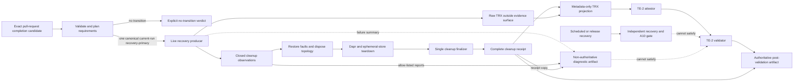

# Architecture Spine — Epic 12 recovery-primary provenance

## Design Paradigm

Pipes-and-filters with single-writer attestation. A transition-only check plans authorized work; the live producer emits raw results and closed cleanup observations outside the evidence surface; the cleanup finalizer alone emits the aggregate receipt; the recovery projector binds that receipt into the metadata-only canonical TRX; the attestor is the only provenance-sidecar writer; the validator consumes immutable inputs; distinct artifact channels retain diagnostic and authoritative outcomes for 30 days.

## Invariants & Rules

### AD-1 — recovery-primary is current-run completion evidence [ADOPTED]

- **Binds:** TE-2 `recovery-primary` policy, Story 12.15 completion contracts, reviewers.
- **Prevents:** an implementer selecting the shipped retained recovery bundle even though no producer can create its required TE-2 sidecar without a locator/digest cycle.
- **Rule:** The policy binding for `recovery-primary` permits only `source: current-run`. Its paths are exactly `recovery-primary/live-recovery-validation.trx` and `recovery-primary/live-recovery-validation.provenance.json`, and its locator is exactly `file:recovery-primary/live-recovery-validation.trx`. An exact transition may have at most one active recovery consumer. A retained source, alternate path, or second consumer must fail before production.

### AD-2 — the exact-head transition job owns production order [ADOPTED]

- **Binds:** `.github/workflows/ci.yml`, `CompletionProductionPlanner`, the recovery live class, the cleanup finalizer, `RecoveryTrxSanitizer`, `ProvenanceAttestor`, and StoryEvidenceGate result paths.
- **Prevents:** attesting a different tree, minting provenance before cleanup is proven, executing destructive recovery on ordinary runs, or uploading evidence that bypassed validation.
- **Rule:** After exact base/head resolution, the repository-owned `plan` command validates pinned policy, strict contract grammar, status/lifecycle, scope digest, File List, checked mapping declarations, safe collision-free result paths, the exact recovery binding, and single-consumer cardinality before it may authorize Dapr. The transition job then runs the bound live class, completes the cleanup-receipt sequence in AD-7, projects its raw TRX into the canonical metadata-only TRX, preflights all current-run lanes before any sidecar write, validates, then publishes authoritative evidence. Producer, timeout, skip/no-test, restoration, cleanup, projection, attestation, validation, or publication failure leaves the transition check red.

### AD-3 — completion and operational evidence have separate trust purposes [ADOPTED]

- **Binds:** scheduled CI recovery, release recovery, the independent recovery evidence gate, A10 governance, and TE-2.
- **Prevents:** treating a domain recovery-gate pass as proof that the story-completion provenance contract was satisfied.
- **Rule:** Scheduled/release recovery bundles feed only the independent recovery/A10 gate. They do not mint TE-2 sidecars and cannot satisfy `recovery-primary`. Adding retained completion later requires a policy-version change and a new architecture decision.

### AD-4 — diagnostic and completion authority are disjoint [ADOPTED]

- **Binds:** workflow permissions, recovery artifact schemas, `RecoveryTrxSanitizer`, both retained artifact channels, and the TE-2 ownership split.
- **Prevents:** a destructive test acquiring repository-write authority, pre-validation output being cited as completion evidence, or completion-run diagnostics being cited as A10 evidence.
- **Rule:** The transition job retains only `contents: read` and `actions: read`. It must attempt a 30-day `recovery-primary-diagnostics` upload on both success and failure; that artifact contains only an `hexalith.chatbot.recovery-primary-diagnostics/v1` inventory, allow-listed scenario reports, `cleanup/recovery-cleanup-receipt.json`, and `failure/recovery-attempt-summary.json`. Its locators name only those entries under `artifact:recovery-primary-diagnostics`; a `test-output` locator, any TRX, or any provenance sidecar is invalid. It has no TE-2 or A10 authority. `story-evidence-integrity-reports` is the sole channel eligible to carry completion authority; it uploads after the TE-2 validation attempt on success or failure, but only a passing report has completion authority. It contains only policy-allowed reports, the validated aggregate receipt, canonical sanitized TRX, and provenance sidecars. The transition producer's raw TRX remains outside every upload path. Amelia owns workflow/schema implementation, Murat owns evidence-authority policy, and Winston reviews the boundary.

### AD-5 — absolute deadlines protect cleanup and publication [ADOPTED]

- **Binds:** `story-transition-evidence-integrity` job/step timeouts, the live test's in-process workflow timeout, teardown, finalization, validation, uploads, and their architecture contract tests.
- **Prevents:** a long producer, teardown, or validation phase consuming the only opportunity to restore faults or retain reconstructable failure evidence.
- **Rule:** Dapr admission is refused at or after absolute job minute 40 and initialization is capped at 10 minutes. The recovery harness owns a 250-minute producer-relative in-process deadline. CI owns a producer-relative external-`SIGINT` cap of 265 minutes, a 15-minute kill-after, and a 285-minute step cap; it also caps `SIGINT` at absolute job minute 315 so forced termination reaches the absolute minute-330 producer hard stop. Topology/Dapr teardown completes or fails by absolute minute 335; cleanup-receipt evaluation, projection, attestation, and validation complete or fail by absolute minute 350. The diagnostic upload exclusively owns minutes 350–355 and the post-validation authoritative/rejection-report upload exclusively owns minutes 355–360; both use always-run semantics, derive remaining time from their absolute deadline, and a failure in the first cannot skip the second. No phase may borrow the next phase's reserve. Amelia may tune implementation values only while contract tests preserve the producer-relative `250 < 265 < 285` ordering and absolute `315 < 330 < 335 < 350 < 355 < 360` ordering; changing either envelope requires architecture review.

### AD-6 — completion uses one globally unique pull-request identity [ADOPTED]

- **Binds:** GitHub Actions event routing, protected-branch rules for `main`, TE-2 ownership, and completion reviewers.
- **Prevents:** a push, scheduled/manual diagnostic, or skipped job evaluating a different range for the same SHA from satisfying or being confused with the story-completion check.
- **Rule:** The CI workflow must always run the exact check-run name `story-transition-evidence-integrity (pull_request)` only for pull requests whose base ref is protected `main`; no-transition is an explicit planner verdict, never a skipped job. Pull requests to other bases and all push, scheduled, and manual runs use globally distinct diagnostic identities with no completion authority, and protected `main` disallows direct pushes. Repository rules for protected `main` must require that exact check name from GitHub Actions. Amelia owns workflow implementation, Murat owns primary-path policy, and Winston reviews the CI boundary. Until the job split, branch rule, expected source, and activation record are independently verified, documentation must say the check **must be required**, never that it **is required**, and Story 12.15 and TE-2 remain `review` with no story or TE permitted to transition to `done` on its authority.

### AD-7 — cleanup completion is a first-class attested input [ADOPTED]

- **Binds:** recovery scenario producers, run-owned persistent mutations, topology teardown, `RecoveryTrxSanitizer`, `ProvenanceAttestor`, and failure diagnostics.
- **Prevents:** a passing TRX being attested while an injected fault, derived-state residue, or ephemeral recovery store remains.
- **Rule:** `recovery-cleanup-policy.json` v1 is the repository-owned expected observation set. Each producer emits `hexalith.chatbot.recovery-cleanup-observation/v1` carrying repository, exact base/head, implementation digest, producer run ID, workflow run ID/attempt, job identity, policy-declared scenario and mutation class, stable postcondition IDs, and outcome `complete`, `incomplete`, or `timed-out`. The mutation set includes injected resource/subscription fault state, run-owned derived/read-model/sentinel/fresh-partition keys, and ephemeral topology state. Immutable EventStore history is never directly deleted; it remains run-scoped until ephemeral-store teardown. After restoration, compensating erasure, a bounded quiescence window, postcondition reads, Aspire disposal, and Dapr/ephemeral-store teardown, one repository-owned finalizer is the sole writer of `hexalith.chatbot.recovery-cleanup-receipt/v1` at `recovery-primary/recovery-cleanup-receipt.json`. It requires exactly one identity-matching observation for every policy-declared scenario/mutation class plus Aspire disposal, Dapr uninstall, and ephemeral-store teardown; missing, duplicate, unexpected, non-`complete`, or non-true required postconditions make the receipt non-complete. `RecoveryTrxSanitizer` accepts only `complete` and hashes the validated exact UTF-8 receipt bytes with SHA-256. `RecoveryCleanupTrxBinding` in StoryEvidenceGate is the sole serializer/parser authority: it writes exactly the unqualified attributes `hexalith.cleanupReceipt.schemaVersion`, `hexalith.cleanupReceipt.status`, and `hexalith.cleanupReceipt.sha256` on the TeamTest `TestRun` root, requires the digest to be 64 lowercase hexadecimal characters, and rejects any missing, duplicate, malformed, or unexpected `hexalith.cleanupReceipt.*` attribute. Both `RecoveryTrxSanitizer` and `StoryEvidenceValidator` use this codec; the validator reloads the retained receipt, revalidates identity/schema/status, recomputes its exact-byte digest, and matches all three attributes before accepting `recovery-primary`. An incomplete or timed-out receipt always produces a stable bounded summary for the protected diagnostic upload and keeps the transition check red.

### AD-8 — repository files own versions; executable dependencies use immutable references [ADOPTED]

- **Binds:** `global.json`, the AppHost SDK/package catalog, the Dapr installer/runtime initialization, and completion-path artifact actions.
- **Prevents:** CI, the recovery topology, and reviewers silently executing different toolchains or mutable artifact transport code.
- **Rule:** `global.json` is the sole .NET SDK authority and CI derives or asserts exact agreement with its `10.0.400` feature band plus `latestPatch` policy. The AppHost SDK and aligned central package catalog are the Aspire authority. Recovery uses Dapr CLI `1.18.2` with the verified Linux x64 archive digest and runtime `1.18.4`. Completion artifact upload/download actions use the full reviewed SHAs in the Stack, with release-version comments; updates require an explicit reviewed dependency change and focused recovery/provenance verification.

### AD-9 — destructive recovery is fully job-isolated [ADOPTED]

- **Binds:** recovery job runner selection, topology/environment admission, tenant/resource identity, secrets, and cross-run cancellation behavior.
- **Prevents:** concurrent or misrouted drills mutating shared state, reaching production dependencies, or one required run canceling another before cleanup completes.
- **Rule:** Recovery runs only on a fresh GitHub-hosted runner with job-local ephemeral topology/state, `Testing` safety guards, generated per-run secrets, and no production endpoints or credentials. The required job has no GitHub concurrency group because a newer run cancels an older pending member even when `cancel-in-progress` is false. Fixed logical test-tenant names are permitted only inside the isolated topology; every run-owned record/resource identity and cleanup observation binds the workflow run ID/attempt, so fully isolated jobs may run concurrently. Reusing shared or self-hosted infrastructure requires a new architecture decision and a non-canceling external lease.

## Consistency Conventions

| Concern | Convention |
| --- | --- |
| Lane identity | `recovery-primary` with selector `class:Hexalith.ChatBot.IntegrationTests.Recovery.LiveContinuityAspireE2eTests` |
| Check identity | `story-transition-evidence-integrity (pull_request)` is always-run only for PRs targeting protected `main`; every other base/event uses a distinct name with no completion authority |
| Current-run paths | Recovery uses the exact policy-pinned TRX/provenance paths and locator from AD-1; there is at most one active recovery consumer |
| Cleanup ownership | Scenario producers emit observations; one post-producer finalizer writes the aggregate receipt; sanitizer binds its digest/status |
| Attestation ownership | `ProvenanceAttestor` is the sole TE-2 sidecar writer and writes only after all current-run lanes preflight |
| Failure | Producer, deadline, restoration, cleanup, validation, and publication failures keep the transition check red; a stable bounded diagnostic summary and both reserved uploads are always attempted |
| Diagnostics | `recovery-primary-diagnostics` is metadata-only, retained for 30 days, and has no TE-2 or A10 authority |
| Authoritative retention | `story-evidence-integrity-reports` publishes only post-validation canonical TRX, sidecars, and policy-allowed reports for 30 days |
| Destructive-run isolation | Fresh GitHub-hosted runner, job-local ephemeral topology, Testing guards, generated secrets, and no canceling GitHub concurrency group |

## Stack

These authorities bind the exact-head completion job and every current-run producer it consumes. AD-3's independently governed scheduled/release operational lanes are outside this completion stack.

| Name | Version / immutable reference |
| --- | --- |
| .NET SDK | `global.json`: 10.0.400 feature band + `latestPatch` (10.0.401 verified 2026-09-14) |
| Aspire AppHost SDK | 13.5.3 |
| Dapr CLI/runtime | 1.18.2 / 1.18.4 |
| Dapr CLI Linux x64 archive SHA-256 | `ccfff008fd16f50096a9192ad56697ac7052e3add6fa0a07789d87b4c4df8c40` |
| actions/upload-artifact | v7.0.1 — `043fb46d1a93c77aae656e7c1c64a875d1fc6a0a` |
| actions/download-artifact | v8.0.1 — `3e5f45b2cfb9172054b4087a40e8e0b5a5461e7c` |
| GitHub Actions job budget | 360 minutes |

## Capability → Architecture Map

| Capability / Area | Lives in | Governed by |
| --- | --- | --- |
| Transition production planning | `CompletionProductionPlanner` plus `.github/workflows/ci.yml` | AD-1, AD-2, AD-6 |
| Live recovery production | `LiveContinuityAspireE2eTests` and conditional transition steps | AD-2, AD-5, AD-7 |
| Cleanup proof and canonical projection | scenario cleanup observations, cleanup finalizer, and `RecoveryTrxSanitizer` | AD-5, AD-7 |
| Sidecar creation and validation | `ProvenanceAttestor` and `StoryEvidenceValidator` | AD-1, AD-2, AD-7 |
| Diagnostic and authoritative retention | two disjoint workflow artifact channels | AD-4, AD-5 |
| Scheduled/release recovery review | recovery workflows and `LiveRecoveryValidationEvidenceGate` | AD-3 |
| Toolchain and transport authority | repository version files, verified Dapr installer, immutable artifact-action SHAs | AD-8 |
| Governance sign-off | protected-branch rules, TE-2 ledger, live-recovery ADR, and PRD decision log | AD-3, AD-6 |
| Destructive-run isolation | CI runner, recovery topology admission, and concurrency group | AD-9 |

## Activation Preconditions

The document's `status: final` and `[ADOPTED]` markers mean its decisions are accepted; `activation: pending` means the updated control is **not implemented or active** until repository reality matches them. Story 12.15 and TE-2 remain `review`. Activation requires all of the following:

- Expose the globally unique, always-run check only for PRs targeting protected `main`, with distinct non-authoritative identities for every other base/event; block direct protected-main pushes and verify protected `main` requires `story-transition-evidence-integrity (pull_request)` from GitHub Actions.
- Separate `recovery-primary-diagnostics` from the post-validation authoritative artifact and enforce both closed publication schemas.
- Implement the aggregate cleanup receipt and sanitizer binding, including timeout/failure paths and the absolute `330/335/350/360` closeout gates.
- Enforce the fresh-runner, ephemeral-topology, safety-guard, identity-binding, no-concurrency-group, and shared-infrastructure prohibition rules in AD-9.
- Align CI with `global.json`, Dapr CLI/runtime `1.18.2/1.18.4`, Aspire 13.5.3, and the reviewed artifact-action SHAs.
- Record activation in TE-2 with the branch pattern, exact check-run name, GitHub Actions source/app, ruleset/protection identifier, owners, and verification run URL/ID.
- Reconcile `docs/story-evidence-integrity.md`, `docs/adrs/live-recovery-validation-drivers.md`, and the companion architecture, then pass the focused recovery/provenance checks and the Reviewer Gate.

## Deferred

- A producer-side retained TE-2 completion lifecycle is excluded. Revisit only if completion must reuse a prior run; require a new ADR, policy version, immutable pre-upload attestation, rerun-attempt-safe artifact identity, and mutation tests.
- Merge-queue `merge_group` enforcement is excluded. Revisit if merge queue is enabled; define its exact transition range and a collision-free required identity before activation.
- `DW-124` remains open under the ChatBot story-evidence gate: standalone attestation can select the 360-minute freshness override from a contract-authored lane name without exact CI planning's binding check. Revisit when every age-overridden lane is allow-listed or binding-verified regardless of `requiredClasses`, proven by refusing `recovery-primary` without its trigger.
- Hosted duration distributions within the adopted admission, producer, closeout, and publication envelope are unproven locally. Revisit the values after the first transition-declared hosted run, but preserve the absolute deadline ordering and fail-closed refusal.
- GitHub artifact retention is immutable only until deletion or expiry; TE-2 does not bind the post-upload artifact ID/digest. Revisit only if long-lived retained completion identity becomes a requirement.
- Recovery authenticity, production equivalence, and A10 target ratification remain Murat/A10 governance concerns. This spine fixes provenance flow only.

## Verified Platform Evidence — 2026-09-14

- .NET 10 release metadata and servicing policy: <https://dotnetcli.blob.core.windows.net/dotnet/release-metadata/10.0/releases.json>, <https://dotnet.microsoft.com/en-us/platform/support/policy/dotnet-core>
- Dapr CLI 1.18.2, runtime 1.18.4, and support/version policy: <https://github.com/dapr/cli/releases/tag/v1.18.2>, <https://github.com/dapr/dapr/releases/tag/v1.18.4>, <https://docs.dapr.io/operations/support/>
- Dapr 1.18.2 security fixes affecting `daprd`: <https://github.com/dapr/dapr/releases/tag/v1.18.2>
- Aspire 13.5.3: <https://github.com/microsoft/aspire/releases/tag/v13.5.3>
- GitHub action reference immutability and current artifact action releases: <https://docs.github.com/en/actions/how-tos/write-workflows/choose-what-workflows-do/find-and-customize-actions>, <https://github.com/actions/upload-artifact/releases/tag/v7.0.1>, <https://github.com/actions/download-artifact/releases/tag/v8.0.1>
- GitHub required-check identity and workflow timeout semantics: <https://docs.github.com/en/enterprise-cloud@latest/repositories/configuring-branches-and-merges-in-your-repository/managing-rulesets/troubleshooting-rules>, <https://docs.github.com/en/actions/reference/workflows-and-actions/workflow-syntax>
- GNU `timeout` interrupt and `--kill-after` semantics: <https://www.gnu.org/software/coreutils/manual/html_node/timeout-invocation.html>
