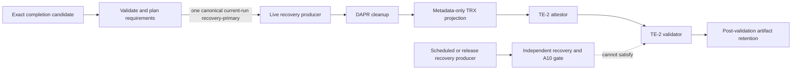

# Architecture Spine — Epic 12 recovery-primary provenance

## Design Paradigm

Pipes-and-filters with single-writer attestation. The side-effect-free completion planner authorizes work; the live producer emits a raw TRX outside the evidence surface; a recovery-specific projector emits the metadata-only canonical TRX; the attestor is the only sidecar writer; the validator consumes immutable inputs; artifact upload retains the outcome for 30 days.

## Invariants & Rules

### AD-1 — recovery-primary is current-run completion evidence [ADOPTED]

- **Binds:** TE-2 `recovery-primary` policy, Story 12.15 completion contracts, reviewers.
- **Prevents:** an implementer selecting the shipped retained recovery bundle even though no producer can create its required TE-2 sidecar without a locator/digest cycle.
- **Rule:** The policy binding for `recovery-primary` permits only `source: current-run`. Its paths are exactly `recovery-primary/live-recovery-validation.trx` and `recovery-primary/live-recovery-validation.provenance.json`, and its locator is exactly `file:recovery-primary/live-recovery-validation.trx`. An exact transition may have at most one active recovery consumer. A retained source, alternate path, or second consumer must fail before production.

### AD-2 — the exact-head completion job owns production order [ADOPTED]

- **Binds:** `.github/workflows/ci.yml`, the recovery live class, `ProvenanceAttestor`, and StoryEvidenceGate result paths.
- **Prevents:** attesting a different tree, minting provenance before the result exists, executing destructive recovery on ordinary runs, or uploading evidence that bypassed cleanup.
- **Rule:** After exact base/head resolution, the repository-owned `plan` command validates pinned policy, strict contract grammar, status/lifecycle, scope digest, File List, checked mapping declarations, safe collision-free result paths, the exact recovery binding, and single-consumer cardinality before it may authorize DAPR. The job then runs the bound live class, requires DAPR cleanup, projects its raw TRX into the canonical metadata-only TRX, preflights all current-run lanes before any sidecar write, validates, then retains the result. Producer, timeout, skip/no-test, cleanup, projection, attestation, or validation failure leaves the required check failed.

### AD-3 — completion and operational evidence have separate trust purposes [ADOPTED]

- **Binds:** scheduled CI recovery, release recovery, the independent recovery evidence gate, A10 governance, and TE-2.
- **Prevents:** treating a domain recovery-gate pass as proof that the story-completion provenance contract was satisfied.
- **Rule:** Scheduled/release recovery bundles feed only the independent recovery/A10 gate. They do not mint TE-2 sidecars and cannot satisfy `recovery-primary`. Adding retained completion later requires a policy-version change and a new architecture decision.

### AD-4 — completion evidence publication is least-privilege and metadata-only [ADOPTED]

- **Binds:** workflow permissions, TE-2 contract/provenance grammar, `RecoveryTrxSanitizer`, and the retained completion artifact.
- **Prevents:** a destructive test acquiring repository-write authority or publishing tenant/test diagnostics as completion evidence.
- **Rule:** The completion job retains only `contents: read` and `actions: read`; contracts, sidecars, and reports carry only policy-allowed metadata. The raw test TRX is staged outside all upload paths. `RecoveryTrxSanitizer` is the sole recovery-TRX publication owner and emits only the bound test identity, times, reconciled counters, IDs, and outcome. Completion-run operational reports/manifests are diagnostics-only and are not uploaded or eligible for A10.

### AD-5 — the outer job owns a cleanup and publication reserve [ADOPTED]

- **Binds:** `story-evidence-integrity` job/step timeouts and the live test's in-process workflow timeout.
- **Prevents:** a valid five-hour inner allowance consuming the six-hour job ceiling before DAPR cleanup, attestation, and retention can execute.
- **Rule:** The job fixes closeout at job start plus 330 minutes and refuses to initialize DAPR at or after 40 minutes elapsed. Initialization is limited to 10 minutes. Immediately before production, the job derives the remaining time to fixed closeout, sends interrupt no later than 15 minutes before that deadline (and no later than the 265-minute in-process deadline), and caps the live step at 280 minutes. DAPR cleanup, projection, attestation, validation, and upload therefore own the final 30 minutes of the 360-minute job budget rather than competing with production for them.

## Consistency Conventions

| Concern | Convention |
| --- | --- |
| Lane identity | `recovery-primary` with selector `class:Hexalith.ChatBot.IntegrationTests.Recovery.LiveContinuityAspireE2eTests` |
| Current-run paths | Recovery uses the exact policy-pinned TRX/provenance paths and locator from AD-1; there is at most one active recovery consumer |
| Attestation ownership | `ProvenanceAttestor` is the sole sidecar writer and writes only after all current-run lanes preflight |
| Failure | Validator/attestation failures use stable TE-2 reason codes; producer, timeout, and DAPR-cleanup failures keep the GitHub check red with bounded step diagnostics and no unchecked raw upload |
| Retention | The sanitized recovery TRX, sidecars, and metadata reports upload on success or failure when present; GitHub retains the deletable/expiring archive for 30 days |

## Stack

These pins bind the exact-head completion job and every current-run producer it consumes. AD-3's independently governed scheduled/release operational lanes are outside this completion stack.

| Name | Version |
| --- | --- |
| .NET SDK | 10.0.302 |
| actions/upload-artifact | v7 |
| actions/download-artifact | v8 |
| Dapr CLI/runtime | 1.18.0 / 1.18.0 |
| Dapr CLI Linux archive SHA-256 | 2a94739e0aa101289d88418225319562bc6800db273b3d9cf819a0efd1ea1bfe |
| GitHub Actions job budget | 360 minutes |

## Capability → Architecture Map

| Capability / Area | Lives in | Governed by |
| --- | --- | --- |
| Transition production planning | `CompletionProductionPlanner` plus `.github/workflows/ci.yml` | AD-1, AD-2 |
| Live recovery production and projection | `LiveContinuityAspireE2eTests`, `RecoveryTrxSanitizer`, and conditional CI steps | AD-2, AD-4, AD-5 |
| Sidecar creation and validation | `ProvenanceAttestor` and `StoryEvidenceValidator` | AD-1, AD-2 |
| Scheduled/release recovery review | recovery workflows and `LiveRecoveryValidationEvidenceGate` | AD-3 |
| Governance sign-off | live-recovery ADR and PRD decision log | AD-1, AD-3 |

## Deferred

- A producer-side retained TE-2 completion lifecycle is excluded. Revisit only if completion must reuse a prior run; require a new ADR, policy version, immutable pre-upload attestation, rerun-attempt-safe artifact identity, and mutation tests.
- Hosted duration distributions within the adopted start/init/producer/closeout envelope are unproven locally. Revisit the values after the first transition-declared hosted run, but preserve the fixed closeout deadline and fail-closed refusal.
- GitHub artifact retention is immutable only until deletion or expiry; TE-2 does not bind the post-upload artifact ID/digest. Revisit only if long-lived retained completion identity becomes a requirement.
- Recovery authenticity, production equivalence, and A10 target ratification remain Murat/A10 governance concerns. This spine fixes provenance flow only.

## Verified Platform Evidence — 2026-08-24

- GitHub job/step timeout semantics: <https://docs.github.com/en/actions/reference/workflows-and-actions/workflow-syntax>
- GitHub context identity (`run_id`, `run_attempt`, repository, SHA): <https://docs.github.com/en/actions/reference/workflows-and-actions/contexts>
- Current artifact actions and post-upload identity/retention behavior: <https://github.com/actions/upload-artifact>, <https://github.com/actions/download-artifact>
- Supported Dapr 1.18 runtime/CLI pairing and runtime pin option: <https://docs.dapr.io/operations/support/support-release-policy>, <https://docs.dapr.io/reference/cli/dapr-init/>
- GNU `timeout` interrupt and `--kill-after` deadline semantics: <https://www.gnu.org/software/coreutils/manual/html_node/timeout-invocation.html>
